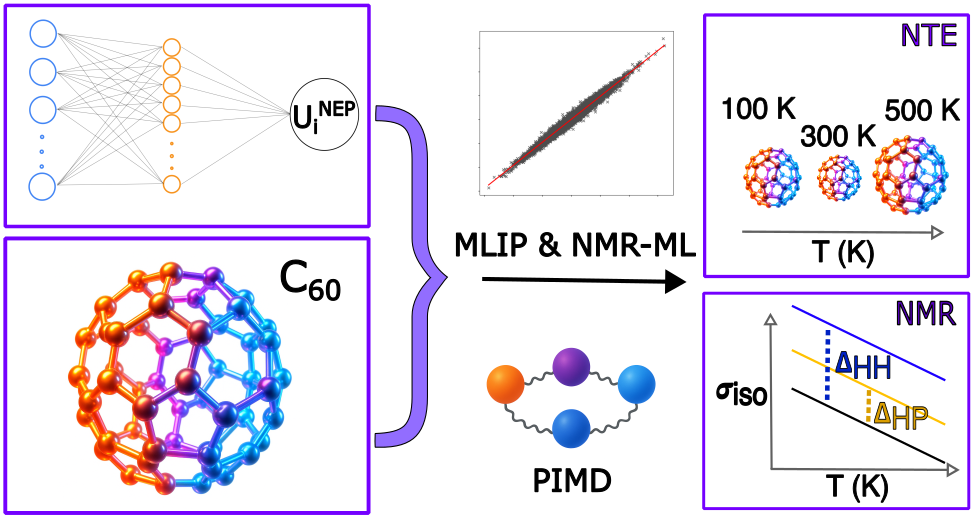

# Supporting Code for “*Machine Learning-Accelerated Path Integral Molecular Dynamics and <sup>13</sup>C NMR Simulations Unlock New Insights Into Quantum Effects in C<sub>60</sub> Fullerene*”

## Graphical Abstract



---

📄 Authors: **Ouail Zakary** and **Ossi Laurila**

---

👤 Corresponding Author: **Ouail Zakary**  
- 📧 Email: [Ouail.Zakary@oulu.fi](mailto:Ouail.Zakary@oulu.fi)  
- 🔗 ORCID: [0000-0002-7793-3306](https://orcid.org/0000-0002-7793-3306)  
- 🌐 Website: [Personal Webpage](https://cc.oulu.fi/~nmrwww/members/Ouail_Zakary.html)  
- 📁 Portfolio: [Academic Portfolio](https://ozakary.github.io/)

---

This is the supporting code for the manuscript “***Machine Learning-Accelerated Path Integral Molecular Dynamics and <sup>13</sup>C NMR Simulations Unlock New Insights Into Quantum Effects in C<sub>60</sub> Fullerene***”. [DOI: TBA]

The repository comprises the following sections:

1. Dataset preparation for the three MLIP models:  
   i. Configuration generation using semi-empirical MD simulations. ([directory](./dftb-md/))  
   ii. DFT calculations of the generated SE-MD configurations for training the three MLIP models. ([directory](./dft_calculations_nep/))  
   iii. Dataset format of the MLIP models. ([directory](./nep-ml_dataset/))  
3. Example of training, validation, and testing processes for a MLIP model using NEP3 architecture. ([directory](./nep-ml_model/))  
4. Machine learning-assisted path-integral MD simulations. ([directory](./pimd_simulations/))  
5. Dataset preparation for the NMR-ML model:  
   i. Configuration generation using semi-empirical MD simulations. ([directory](./dftb-md/))  
   ii. DFT calculations for the NMR-ML model. ([directory](./dft_calculations_schnet/))  
   iii. Dataset format for the NMR-ML model. ([directory](./nmr-ml_dataset/))  
6. Training, validation, and testing processes for the NMR-ML model using SchNet architecture on NMR magnetic shielding parameters, including the skew, span, and σ<sub>iso</sub>. ([directory](./nmr-ml_model/))  
7. Prediction of NMR isotropic magnetic shielding values, σ<sub>iso</sub>, from the pre-trained NMR-ML model. ([directory](./nmr-ml_prediction/))  
8. Python scripts and raw numerical data for all figures related to the NMR-ML model included in the main manuscript and the Supporting Information. ([directory](./figures/))  

## Citations
If you use this data, please cite the following:

### Preprint

```bibtex
@article{laurila_2025_c60_ml,
  title={Machine Learning-Accelerated Path Integral Molecular Dynamics and $^{13}$C NMR Simulations Unlock New Insights Into Quantum Effects in C$_{60}$ Fullerene},
  author={Laurila, Ossi, and Jacklin, Tiia, and Zakary, Ouail and Lantto, Perttu},
  journal={In preparation},
  year={2025},
  note={DOI: To be announced}
}
```

### Dataset [](https://doi.org/10.23729/fd-c64c043e-473e-371d-9586-8fd3d04e2fb0)

```bibtex
@dataset{laurila_2025_data_c60_ml,
  author = {Laurila, Ossi, and Jacklin, Tiia, and Zakary, Ouail and Lantto, Perttu},
  title = {Supporting Data for "Machine Learning-Accelerated Path Integral Molecular Dynamics and $^{13}$C NMR Simulations Unlock New Insights Into Quantum Effects in C$_{60}$ Fullerene"},
  year = {2025},
  publisher = {Fairdata},
  doi = {10.23729/fd-c64c043e-473e-371d-9586-8fd3d04e2fb0},
  url = {https://doi.org/10.23729/fd-c64c043e-473e-371d-9586-8fd3d04e2fb0}
}
```

### Code [](https://github.com/ozakary/data-C60_ML)
```bibtex
@misc{laurila_2025_github_c60_ml,
  author = {Laurila, Ossi, and Jacklin, Tiia, and Zakary, Ouail and Lantto, Perttu},
  title = {Supporting Code for "Machine Learning-Accelerated Path Integral Molecular Dynamics and $^{13}$C NMR Simulations Unlock New Insights Into Quantum Effects in C$_{60}$ Fullerene"},
  year = {2025},
  publisher = {GitHub},
  journal = {GitHub repository},
  howpublished = {\url{https://github.com/ozakary/data-C60_ML}},
  url = {https://github.com/ozakary/data-C60_ML}
}
```

---
For further details, please refer to the respective folders or contact the author via the provided email.
